# Mindra 构建和发布系统

🚀 **一键构建、测试、发布的完整解决方案**

## 快速开始

### 🔧 环境准备

```bash
# 1. 检查 Flutter 环境
flutter doctor

# 2. 安装 Fastlane (可选)
gem install fastlane

# 3. 设置执行权限
chmod +x scripts/*.sh
```

### ⚡ 快速部署

```bash
# 开发环境部署
./scripts/quick_deploy.sh -e dev

# 测试环境部署
./scripts/quick_deploy.sh -e staging --bump-version patch

# 生产环境部署
./scripts/quick_deploy.sh -e prod --bump-version minor
```

## 📁 核心脚本

| 脚本 | 功能 | 示例 |
|------|------|------|
| `build_all.sh` | 跨平台构建 | `./scripts/build_all.sh --archive` |
| `build_android.sh` | Android 构建 | `./scripts/build_android.sh -b` |
| `build_ios.sh` | iOS 构建 | `./scripts/build_ios.sh -a` |
| `release_android.sh` | Android 发布 | `./scripts/release_android.sh -t beta` |
| `release_ios.sh` | iOS 发布 | `./scripts/release_ios.sh -t` |
| `version_manager.sh` | 版本管理 | `./scripts/version_manager.sh bump patch` |
| `quick_deploy.sh` | 一键部署 | `./scripts/quick_deploy.sh -e prod` |

## 🎯 常用命令

### 构建应用

```bash
# 构建所有平台
./scripts/build_all.sh

# 仅构建 Android AAB
./scripts/build_android.sh -b

# 仅构建 iOS Archive
./scripts/build_ios.sh -a

# 清理后构建
./scripts/build_all.sh -c --archive
```

### 版本管理

```bash
# 查看当前版本
./scripts/version_manager.sh show

# 递增补丁版本 (1.0.0 → 1.0.1)
./scripts/version_manager.sh bump patch

# 递增次版本 (1.0.0 → 1.1.0)
./scripts/version_manager.sh bump minor

# 递增主版本 (1.0.0 → 2.0.0)
./scripts/version_manager.sh bump major

# 设置指定版本
./scripts/version_manager.sh set 1.2.0+5
```

### 发布应用

```bash
# Android 发布到内部测试
./scripts/release_android.sh -t internal

# Android 发布到测试版
./scripts/release_android.sh -t beta

# iOS 发布到 TestFlight
./scripts/release_ios.sh -t

# 模拟发布（不实际上传）
./scripts/release_android.sh -t beta --dry-run
```

## 🔄 发布流程

### 标准发布流程

```mermaid
graph LR
    A[开发] --> B[内部测试]
    B --> C[封闭测试]
    C --> D[开放测试]
    D --> E[生产发布]
```



### 环境对应关系

| 环境 | Android 轨道 | iOS 轨道 | 用途 |
|------|-------------|----------|------|
| dev | internal | TestFlight 内部 | 开发团队测试 |
| staging | beta | TestFlight 外部 | 用户测试 |
| prod | production | App Store | 正式发布 |

## 🤖 自动化 CI/CD

### GitHub Actions 工作流

- **构建和测试**: 每次推送自动触发
- **代码质量检查**: 格式、分析、测试覆盖率
- **自动发布**: 标签推送触发生产发布

### 触发方式

```bash
# 推送代码触发构建
git push origin main

# 创建标签触发发布
git tag v1.0.0
git push origin v1.0.0

# 手动触发工作流
# 在 GitHub Actions 页面手动运行
```

## 📋 首次设置

### 1. Android 签名配置

```bash
# 创建发布密钥库
./scripts/create_release_keystore.sh

# 配置环境变量
export ANDROID_HOME=/path/to/android/sdk
```

### 2. iOS 证书配置

```bash
# 在 Xcode 中配置开发者账号
# 设置环境变量
export APPLE_ID=your-apple-id@example.com
export APP_SPECIFIC_PASSWORD=your-app-password
```

### 3. Fastlane 配置 (可选)

```bash
# Android
cd android
fastlane init

# iOS
cd ios
fastlane init
```

## 🛠️ 故障排除

### 常见问题

1. **构建失败**
   ```bash
   flutter clean
   flutter pub get
   flutter doctor
   ```

2. **签名问题**
   ```bash
   # Android: 检查 key.properties
   # iOS: 重新配置证书
   ```

3. **版本冲突**
   ```bash
   ./scripts/version_manager.sh show
   ./scripts/version_manager.sh bump patch
   ```

### 调试技巧

- 使用 `--dry-run` 模拟运行
- 查看生成的报告文件
- 检查 `build_summary.sh` 输出

## 📚 详细文档

- [完整构建发布指南](docs/build_and_release_summary.md)
- [应用商店发布指南](docs/app_store_release_guide.md)
- [应用商店发布指南 (英文)](docs/app_store_release_guide_en.md)

## 🎉 快速示例

### 完整发布流程示例

```bash
# 1. 开发完成，准备发布
git add .
git commit -m "feat: add new meditation features"

# 2. 递增版本号
./scripts/version_manager.sh bump minor

# 3. 构建和测试
./scripts/build_all.sh --archive

# 4. 发布到测试环境
./scripts/quick_deploy.sh -e staging

# 5. 测试通过后发布到生产环境
./scripts/quick_deploy.sh -e prod

# 6. 创建发布标签
./scripts/version_manager.sh tag
```

### 紧急修复流程

```bash
# 1. 修复问题
git add .
git commit -m "fix: critical bug fix"

# 2. 递增补丁版本
./scripts/version_manager.sh bump patch

# 3. 快速发布
./scripts/quick_deploy.sh -e prod --skip-tests
```

## 📞 支持

- 📧 **邮箱**: support@mindra.gonewx.com
- 📖 **文档**: 查看 `docs/` 目录
- 🐛 **问题**: 提交 GitHub Issues
- 💬 **讨论**: GitHub Discussions

---

**提示**: 首次使用前请阅读 [详细文档](docs/build_and_release_summary.md) 了解完整配置步骤。
