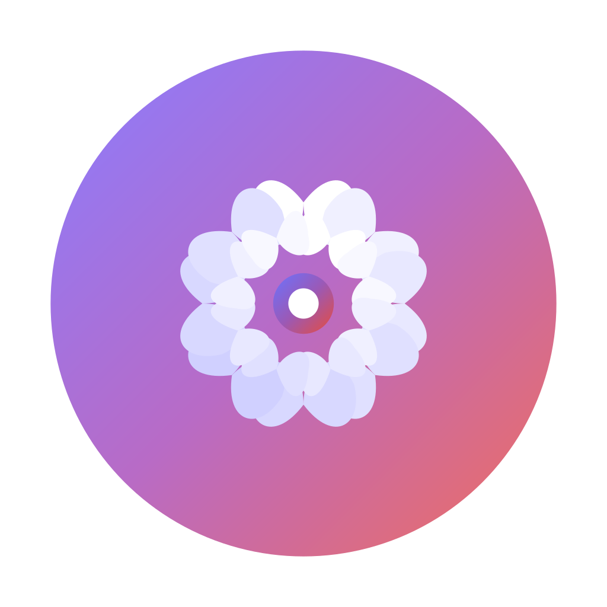

# Mindra - Professional Meditation & Mindfulness App

<div align="center">
  
  
  <h3>🧘‍♀️ Begin your meditation journey, let your mind find peace and focus</h3>
  
  [](https://flutter.dev)
  [](https://dart.dev)
  [](LICENSE)
  [](https://flutter.dev/multi-platform)
</div>

## Language / 语言

[🇺🇸 English](#english) | [🇨🇳 中文](README_ZH.md)

---

# English

## ✨ Project Overview

**Mindra** is a professional meditation and mindfulness application built with Flutter, supporting multi-platform deployment. The app name combines "Mind" (mind/thoughts) with "Mantra" (sacred utterance), incorporating a "Sandra"-style feminine ending to create an intimate yet mystical atmosphere, suggesting meditation and inner dialogue.

### 🎯 Core Values
- 🎵 **Personalized Experience** - Support for local and network audio/video content import
- 🧘 **Professional Features** - Complete meditation session management and progress tracking
- 🎨 **Beautiful Interface** - Modern Material Design 3 design language
- 🌍 **Multi-language Support** - Chinese and English bilingual interface
- 📱 **Cross-platform** - Full platform support for iOS, Android, Web, Desktop (Linux AppImage only)

## 🚀 Main Features

### 📚 Content Management
- **Local Import** - Import audio/video files from device storage
- **Network Import** - Add network audio/video resources via URL
- **Smart Categorization** - Multiple categories including meditation, sleep, focus, relaxation
- **Metadata Management** - Auto-fetch or manually edit content information

### 🎵 Meditation Player
- **Multi-media Support** - Audio (MP3, AAC, WAV, FLAC, etc.) and video (MP4, MOV, etc.)
- **Advanced Playback Controls** - Play, pause, fast forward, rewind, loop playback
- **Background Playback** - Support for audio background playback and screen-off playback
- **Playback Memory** - Auto-record playback progress, resume from breakpoint
- **Natural Sound Effects** - Overlay rain, ocean waves, bird songs and other ambient sounds

### 📊 Session Tracking
- **Smart Recording** - Auto-record meditation session duration and type
- **Progress Statistics** - Visual display of meditation habits and growth trajectory
- **Goal Setting** - Set daily/weekly meditation goals
- **Achievement System** - Badges and achievements to motivate continuous practice

### ⏰ Smart Reminders
- **Timed Reminders** - Customize meditation reminder time and frequency
- **Sleep Timer** - Set playback duration with auto-stop
- **Push Notifications** - Local notification reminders for meditation time

### 🎨 Personalization
- **Multiple Theme Switching** - Dark, light, natural and other themes
- **Interface Customization** - Adjust card spacing, padding and other UI elements
- **Language Switching** - Chinese and English interface language switching

## 🛠️ Tech Stack

### Core Framework
- **Flutter 3.8.1+** - Cross-platform UI framework
- **Dart 3.8.1+** - Programming language

### State Management
- **BLoC Pattern** - Business Logic Component pattern
- **Provider** - Lightweight state management
- **HydratedBLoC** - State persistence

### Data Storage
- **SQLite** - Local database (mobile)
- **Web Storage** - Browser storage (web)
- **SharedPreferences** - User preference settings

### Audio/Video Processing
- **AudioPlayers** - Audio playback engine
- **VideoPlayer** - Video playback support
- **AudioService** - Background audio service

### Network & Files
- **Dio** - HTTP network requests
- **FilePicker** - File picker
- **YouTubeExplode** - Network video parsing

### UI Components
- **Material Design 3** - Modern design language
- **FlutterSVG** - SVG image support
- **CachedNetworkImage** - Network image caching
- **Shimmer** - Loading animation effects

## 📱 Supported Platforms

| Platform | Status | Notes |
|----------|--------|-------|
| 🤖 Android | ✅ Tested | Android 5.0+ (API 21+) - Tested ✓ |
| 🐧 Linux | ✅ Tested | Ubuntu 22.04+ - Tested ✓ |
| 📱 iOS | ✅ Supported | iOS 12.0+ |
| 🌐 Web | ✅ Supported | Modern browsers |
| 🖥️ Windows | ✅ Supported | Windows 10+ |
| 🍎 macOS | ✅ Supported | macOS 10.14+ |

## 🚀 Quick Start

### Requirements

- Flutter SDK 3.32.5 or higher
- Dart SDK 3.8.1 or higher
- Corresponding platform development environment (Android Studio, Xcode, etc.)

### Installation

1. **Clone Repository**
   ```bash
   git clone https://github.com/gonewx/mindra.git
   cd mindra
   ```

2. **Install Dependencies**
   ```bash
   flutter pub get
   ```

3. **Run Application**
   ```bash
   # Run in development mode
   flutter run
   
   # Run on specific platform (tested platforms)
   flutter run                  # Android - Tested ✓
   flutter run -d linux         # Linux - Tested ✓
   flutter run -d chrome        # Web
   flutter run -d macos         # macOS
   flutter run -d windows       # Windows
   ```

4. **Build Release Version**
   ```bash
   # Android APK
   flutter build apk
   
   # iOS
   flutter build ios
   
   # Web
   flutter build web
   ```

### Development Commands

```bash
# Code analysis
flutter analyze

# Run tests
flutter test

# Code formatting
dart format .

# Clean build cache
flutter clean
```

## 📂 Project Structure

```
mindra/
├── lib/
│   ├── main.dart                    # App entry point
│   ├── core/                        # Core functionality
│   │   ├── audio/                   # Audio player
│   │   ├── config/                  # App configuration
│   │   ├── constants/               # Constants definition
│   │   ├── database/                # Database management
│   │   ├── di/                      # Dependency injection
│   │   ├── localization/            # Internationalization
│   │   ├── router/                  # Route management
│   │   ├── services/                # Core services
│   │   ├── theme/                   # Theme management
│   │   └── utils/                   # Utility classes
│   ├── features/                    # Feature modules
│   │   ├── home/                    # Home page
│   │   ├── media/                   # Media management
│   │   ├── meditation/              # Meditation sessions
│   │   ├── onboarding/              # Onboarding pages
│   │   ├── player/                  # Player
│   │   ├── settings/                # Settings
│   │   ├── splash/                  # Splash screen
│   │   └── theme/                   # Theme settings
│   └── shared/                      # Shared components
│       ├── utils/                   # Shared utilities
│       └── widgets/                 # Shared widgets
├── assets/                          # Asset files
│   ├── audio/effects/               # Sound effect files
│   ├── images/                      # Image resources
│   └── translations/                # Translation files
├── test/                           # Test files
└── docs/                           # Documentation
```

## 🏗️ Architecture Design

### Clean Architecture
The project adopts Clean Architecture pattern with three layers:

- **Presentation Layer** - UI interface and state management
- **Domain Layer** - Business logic and entity definitions
- **Data Layer** - Data access and external services

### BLoC Pattern
Uses BLoC pattern for state management:

- **Events** - User action events
- **States** - UI state definitions
- **BLoCs** - Business logic processing

### Dependency Injection
Uses GetIt + Injectable for dependency injection management, ensuring code testability and maintainability.

## 🧪 Testing

The project includes a complete test suite:

```bash
# Run all tests
flutter test

# Run specific test
flutter test test/database_test.dart

# Test coverage
flutter test --coverage
```

### Test Types
- **Unit Tests** - Core business logic testing
- **Widget Tests** - UI component testing
- **Integration Tests** - Feature integration testing
- **Localization Tests** - Multi-language support testing

## 📦 Build & Release

The project provides complete build and release scripts:

### Automation Scripts
- `build_all.sh` - Cross-platform build
- `build_android.sh` - Android build
- `build_ios.sh` - iOS build
- `release_android.sh` - Android release
- `release_ios.sh` - iOS release
- `version_manager.sh` - Version management

### Quick Deployment
```bash
# Development environment deployment
./scripts/quick_deploy.sh -e dev

# Production environment deployment
./scripts/quick_deploy.sh -e prod
```

For detailed instructions, see [Build Release Guide](BUILD_RELEASE_README.md).

## 🌍 Internationalization

The app supports multiple languages:

- 🇨🇳 **Simplified Chinese** - Default language
- 🇺🇸 **English** - English support

### Adding New Languages
1. Add translations in `lib/core/localization/app_localizations.dart`
2. Update `supportedLocales` configuration
3. Rebuild the app

## 🤝 Contributing

Contributions are welcome! Please follow these steps:

1. Fork the project
2. Create feature branch (`git checkout -b feature/amazing-feature`)
3. Commit changes (`git commit -m 'Add some amazing feature'`)
4. Push to branch (`git push origin feature/amazing-feature`)
5. Create Pull Request

### Code Standards
- Follow Dart official code style
- Use `dart format` to format code
- Pass `flutter analyze` static analysis
- Write corresponding test cases

## 📄 License

This project is licensed under the MIT License - see [LICENSE](LICENSE) file for details.

## 🙏 Acknowledgments

Thanks to the following open source projects:

- [Flutter](https://flutter.dev) - Cross-platform UI framework
- [BLoC](https://bloclibrary.dev) - State management library
- [AudioPlayers](https://pub.dev/packages/audioplayers) - Audio playback
- [GoRouter](https://pub.dev/packages/go_router) - Route management

## 📞 Support & Feedback

- 📧 **Email**: support@mindra.gonewx.com
- 🐛 **Issue Feedback**: [GitHub Issues](https://github.com/gonewx/mindra/issues)
- 💬 **Discussion**: [GitHub Discussions](https://github.com/gonewx/mindra/discussions)
- 📖 **Documentation**: [Project Docs](docs/)

## 🗺️ Roadmap

### Completed ✅
- [x] Core playback functionality
- [x] Content management system
- [x] Meditation session tracking
- [x] Multi-theme support
- [x] Internationalization support
- [x] Cross-platform support
- [x] Android platform testing verification
- [x] Linux platform testing verification

### In Development 🚧
- [ ] Community features
- [ ] AI recommendation system
- [ ] Cloud sync functionality
- [ ] Advanced statistical analysis

### Planned 📋
- [ ] Smart voice assistant
- [ ] VR/AR meditation experience
- [ ] Professional course content
- [ ] Social sharing features

---

<div align="center">
  <p>Crafted with care, focused on meditation 🧘‍♀️</p>
  <p>Made with ❤️ by Mindra Team</p>
</div>